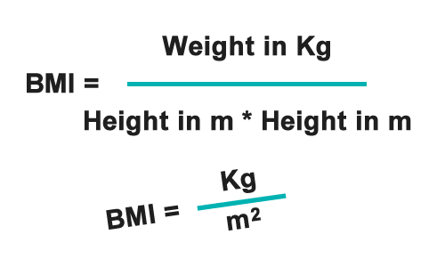

# <a name="anchorTop"></a>Desafio Bootcamp everis Kotlin Developer
> Projeto baseado nos desafios do **Bootcamp everis Kotlin Developer**.


### Oi,

Este é um projeto referente ao exercício proposto no **Bootcamp everis Kotlin Developer** onde fomos convidados a recriar a calculadora IMC ***(BMI - Body Mass Index)*** usada em uma das aulas.

Como plus para esse projeto, foi adicionada uma nova feature para calcular o Percentual de Gordura baseada no resultado do IMC - ***(BFP - Body Fat Percentage based on BMI)*** incluindo a arquitetura **MVVM**.


## O projeto tem como base

- Kotlin
- MVI (MVVM) Architecture (Arquitetura em uso:MVI Model View Intent qualquer atualização da IU é definida por um novo estado. Seria um componente a mais usado na arquitetura MVVM do que uma arquitetura propriamente dita.
- View Binding
- SharedPreferences
- Coroutine Scope, Flow
- ViewFlipper
- DayNight Theme
- Third-party library GaugeView (http://www.sccomponents.com/)
- Guidelines - Material Design


| EXERCÍCIO | NÍVEL | SOLUÇÃO |
| :--: | :--: | :--: |
| [Fórmulas](#anchor01) | Básico | [Lógica](app/src/main/java/fbo/costa/bootcampeveris/repository/RepositoryChallenge1.kt) |


 > ### [Download APK](https://github.com/F4bioo/BMI/raw/master/app/release/app-release.apk)


### Tela sugerida

Suggested screen
</img>


### Minha Implementação

My implementation
</img>
</img>
</img>
</img>

# <a id="anchor01"></a>Desafio 01 

### [voltar ao topo](#anchorTop)

## **BMI - Body Mass Index**
Índice de Massa Corporal
Fórmula para adultos
</img>

```sh
BMI = (weight(kg) / height (m²))
```


## **BFP - Body Fat Percentage based on BMI**
Percentual de Gordura baseada no IMC
Fórmula para adultos

```sh
gender = if female 0; if male 1;
BFP = ((1.2 * imc) + (0.23 * age) - (10.8 * gender) - 5.4)
```
